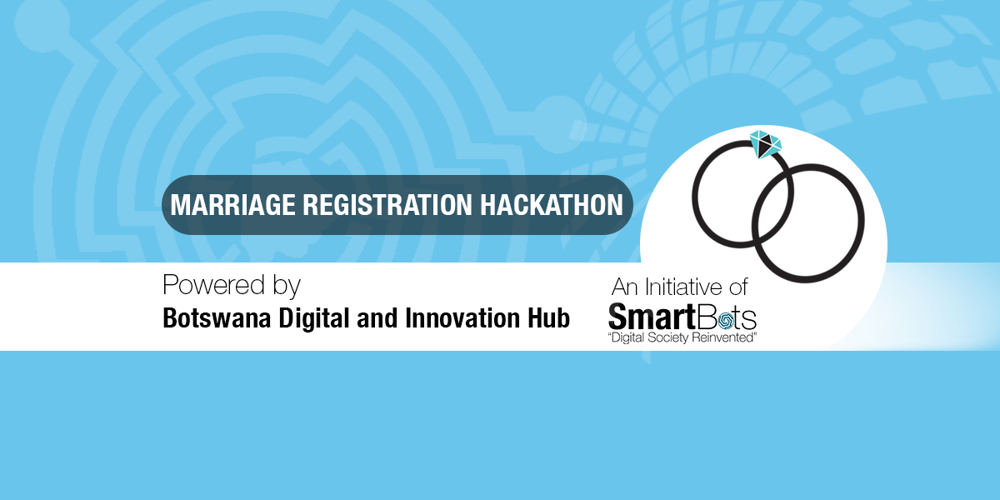

 
  

<h1 align="center">
Marriage Registration Portal-Hackathon Submission</h1>
<h3 align="center"> 
The Department of Civil and National Registration under the Ministry of Nationality, Immigration and Gender Affairs provide Marriage Registration, Property Instrument registration and Change of name services to the public.

The public have to visit the various Government offices to access these services. There are forms that needs to be completed, some need to be publicized/floated in notice boards throughout the country and the Government gazette. These services are only accessible during normal working hours. The marriage registration service requires payments through the revenue offices.
</h3>  

 

 
  

<!-- TABLE OF CONTENTS -->
<h2 id="table-of-contents"> :book: Structure</h2>

  
Table of Contents

  <ol>
    <li><a href="#problem-statement"> ➤ Problem Statement</a></li>
     <li><a href="#research"> ➤ Research</a></li>
    <li><a href="#stack"> ➤ Stack</a></li>
    <li><a href="#demo"> ➤ Demo (API Architecture) </a></li>
    <li><a href="#doc"> ➤ API/Developer Docummentation</a></li>
    <li><a href="#team"> ➤ Team</a></li>
    
  </ol>

<!-- PROBLEM STATEMENT -->
<h2 id="problem-statement"> :pencil: Problem Statement</h2>

 
The Department of Civil and National Registration under the Ministry of Nationality, Immigration and Gender Affairs provide Marriage Registration, Property Instrument registration and Change of name services to the public.

The public have to visit the various Government offices to access these services. There are forms that needs to be completed, some need to be publicized/floated in notice boards throughout the country and the Government gazette. These services are only accessible during normal working hours. The marriage registration service requires payments through the revenue offices.

Marriage registration currently involves:

1.  Applicant visits the Government offices to register their intention to marry.
2.  Payment of, P40.00 for normal /after banns marriage and P190,00 for Special marriage license.
3.  Floating of marriage notice.

Property Instrument registration entails:

1.  Signing of the property instrument before solemnization.
2.  Registration of the instrument at the Deeds Registry within 9 days for validity.

Change of name service involves:

1.  Applicant visits Government offices to complete Change of name form.
2.  The application will then be processed and publicised in the Government Gazette for 30 days.
3.  Authorisation/Approval of change of name.
 
All the above services are currently done manually. This is time consuming and costly for both the Government of Botswana and the general public. Physical access to these services limit their availability and accessibility. The manual processing is inefficient resulting in backlogs, loss of information and prone to errors. Additionally, the publicizing and communication related to these processes is not efficient and is limited.

<!-- analytics-->
<h2 id="research"> 📋: Research Findings</h2>

<!-- _Developer Documentation. Please refer to the [Link](https://documenter.getpostman.com/view/12221940/UVC2GTyP)_ -->

 
  Findings
  

 

 
 
 <!-- <a href="https://docs.google.com/presentation/d/1q1V6qgiDrBObpEXmhjADp2QHiK-3EmuLFjKhTeyLwk0/edit?usp=sharing"> ➤ Design Thinking</a> -->

 

<!-- PREREQUISITES -->
<h2 id="stack"> :computer: Stack</h2>

<!--This project is written in Python and Javascript  -->
The stack used to build this project:
* Nodejs(endpoints)
* Postman(Testing & creating Developer Docummentation)

<!-- analytics-->
<h2 id="demo"> 📋: Demo  </h2>

<!-- _Architecture Demonstration . Please refer to the [Link](https://youtu.be/TU-ylUORo4c)_ -->

 
  Portal Screens
  

 
  

 
  

 
  

 
 
 <!-- <a href="https://docs.google.com/presentation/d/1q1V6qgiDrBObpEXmhjADp2QHiK-3EmuLFjKhTeyLwk0/edit?usp=sharing"> ➤ Design Thinking</a> -->

 

<!-- analytics-->
<h2 id="doc"> 📋: Developer Documentation </h2>

_Developer Documentation. Please refer to the [Link](https://documenter.getpostman.com/view/12221940/UVC3jStF)_

 
  Developer Documentation
  
<!-- 
 
  

 -->
<!-- 
 
  

 -->

 
  

 
 
 <a href="https://docs.google.com/presentation/d/1q1V6qgiDrBObpEXmhjADp2QHiK-3EmuLFjKhTeyLwk0/edit?usp=sharing"> ➤ Design Thinking</a>

 

<!-- analytics-->
<h2 id="team"> 📋: Team-Xavier Africa</h2>

 
<table>
  <tr>
   <td align="center"><a href="https://github.com/identicons/jasonlong.png"> <b>Leloba</b></a> <a href="#eventOrganizing-lolo" title="Project Setup">📋</a> <a href="#example-lolo" title="Code">💻</a></td>
<td align="center"><a href="https://github.com/kesbeast23"> <b>Kesego</b></a> <a href="#eventOrganizing-Kesego23" title="Event Organizing">📋</a> <a href="#example-Kesbeast23" title="Documentation">📖</a> <a href="#example-kesbeast23" title="Code">💻</a></td>
<td align="center"><a href="https://github.com/identicons/jasonlong.png"> <b>Thabang</b></a> <a href="#eventOrganizing-lolo" title="Project Setup">📋</a> <a href="#example-lolo" title="Code">💻</a></td>
<td align="center"><a href="https://github.com/identicons/jasonlong.png"> <b>Duduetsang</b></a> <a href="#eventOrganizing-thabang" title="Project Setup">📋</a> <a href="#example-Dudu" title="Code">💻</a></td>
    <td align="center"><a href="https://github.com/identicons/jasonlong.png"> <b>Withus</b></a> <a href="#eventOrganizing-withus" title="Project Setup">📋</a> <a href="#example-withus" title="Code">💻</a></td>
    <td align="center"><a href="https://github.com/identicons/jasonlong.png"> <b>Letso</b></a> <a href="#eventOrganizing-letso" title="Project Setup">📋</a> <a href="#example-Letso" title="Code">💻</a></td>
  </tr>
</table>

 

<!-- tutorial-->
<h2 id="tut"> :computer: How to get Started </h2>

1. Click on the link to the web portal
`https://github.com/Xavier-Botswana/MarriageHack_Landing.git`
2. Login with your OneGov credentials
3. Start filling in the appropriate information
4. Pay the processing fees when prompted
5. Submit your request
6. Await application processing & publishing in the Government Gazette for 30 days. 

